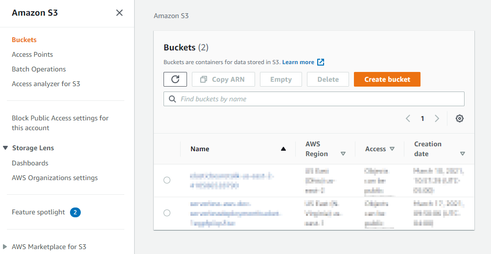

# Serverless AWS Developement
## Build and run applications without servers
Serverless is a way to describe the services, practices, and strategies that enable you to build more agile applications so you can innovate and respond to change faster. With serverless computing, infrastructure management tasks like capacity provisioning and patching are handled by AWS, so you can focus on only writing code that serves your customers. Serverless services like [AWS Lambda](https://aws.amazon.com/lambda/) come with automatic scaling, built-in high availability, and a pay-for-value billing model. Lambda is an event-driven compute service that enables you to run code in response to events from over 150 natively-integrated AWS and SaaS sources - all without managing any servers.

_**Note:** The following packages need to be installed globally on the local machine:_

`Serverless` must be installed globally on your local machine.
To do this, ensure Nodejs and Npm is installed and run the `npm install -g serverless`.
For further documentation please visit [Serverless](https://www.serverless.com/framework/docs/) site.

`AWS CLI` must be installed and configured globally on your local machine.
To do this, please visit [ASW Command Line Interface](https://docs.aws.amazon.com/cli/latest/userguide/cli-chap-welcome.html) for documentation, downloads and configuration.

## Install Required Node Modules 
Any dependencies/node modules required in scripts will be stored in the package.json file.
To add packages run `npm install -g <package_name> --save`. This command will download the dependencies and save the package name in the package.json

To install any dependencies run `npm install`. This will install all packages defined in the package.json your local machine for development.

## Deploy A Package to A AWS S3 Container
To deploy the local service to AWS, run `serverless deploy`

Once the code has been deployed, you will receive a message similar to:
```sh
Serverless: Packaging service...
Serverless: Excluding development dependencies...
Serverless: Creating Stack...
Serverless: Checking Stack create progress...
........
Serverless: Stack create finished...
Serverless: Uploading CloudFormation file to S3...
Serverless: Uploading artifacts...
Serverless: Uploading service serverless-aws.zip file to S3 (864.11 KB)...
Serverless: Validating template...
Serverless: Updating Stack...
Serverless: Checking Stack update progress...
..............................
Serverless: Stack update finished...
Service Information
service: serverless-aws
stage: dev
region: us-east-1
stack: serverless-aws-dev
resources: 11
api keys:
  None
endpoints:
  GET - https://1smbddldhteox5n9a.execute-api.us-east-1.amazonaws.com/dev/users
functions:
  hello: serverless-aws-dev-users
layers:
  None
```

Deployments to AWS can be found in [Amazon S3 ](https://s3.console.aws.amazon.com/s3/home?region=us-east-2#)



For more information on configuring `serverless` please visit [Serverless](https://www.serverless.com/framework/docs/) website.


#### Support
Please open a [GitHub issue](https://github.com/erickknaebel/simple-serverless-aws-function).

#### Feedback
Please open a [GitHub issue](https://github.com/erickknaebel/simple-serverless-aws-function). I do encourage you to contribute your changes and send me pull request.

###### References
[1] - [Serverless on AWS](https://aws.amazon.com/serverless/)
[2] - [ASW Command Line Interface](https://docs.aws.amazon.com/cli/latest/userguide/cli-chap-welcome.html)
[3] - [AWS Lambda](https://aws.amazon.com/lambda/)